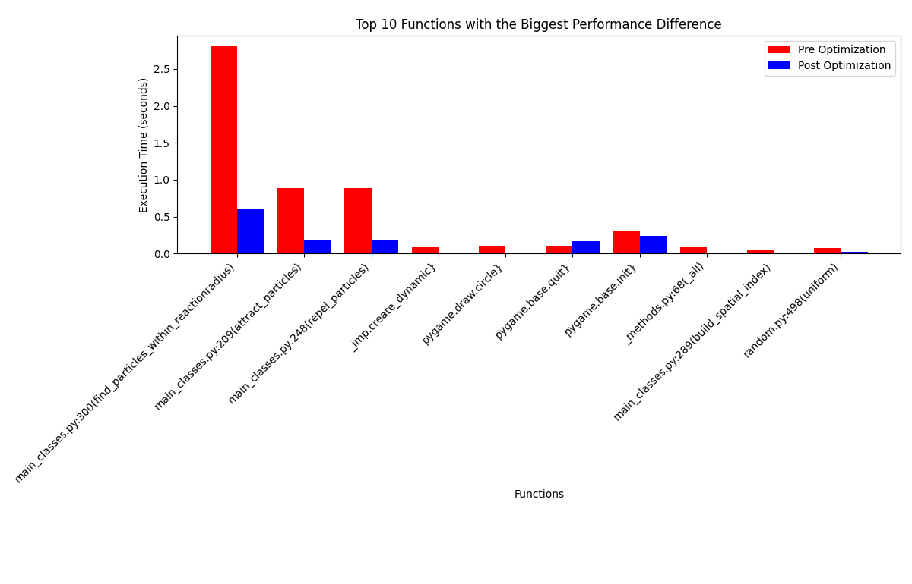
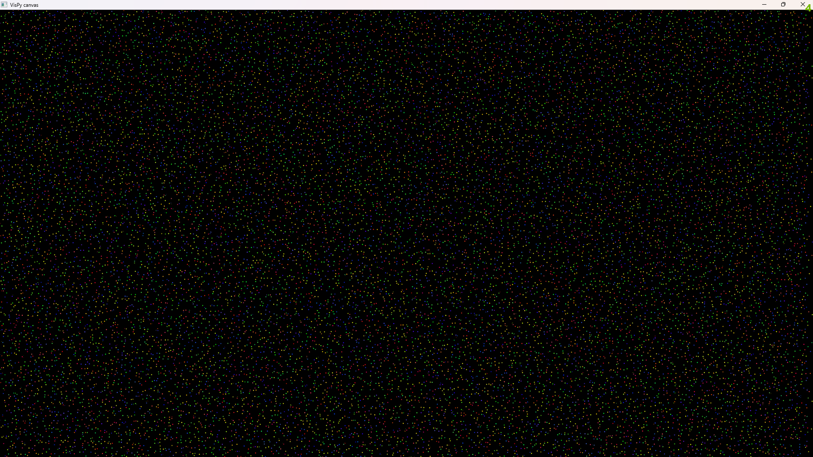

Below is a complete README draft that follows your outline and incorporates details from your project scripts:

---

# Particle Simulator

*Biology-Inspired Emergent Particle Simulation*  
by Mohamad Aimesh, Jasmin Al Karawani, Julia Moor, Dalia Salih, Anton Rabanus.

---

## Table of Contents
- [Introduction](#introduction)
- [Project Overview](#project-overview)
- [Features](#features)
- [Installation](#installation)
- [Usage](#usage)
- [Project Architecture](#project-architecture)
- [Performance Optimization](#performance-optimization)
- [Testing & CI](#testing--ci)
- [Project Management](#project-management)
- [Challenges & Lessons Learned](#challenges--lessons-learned)
- [Future Work](#future-work)
- [Authors](#authors)
- [License](#license)

---

## Introduction

- **Purpose:**  
  The Particle Simulator is designed to model a dynamic system where thousands of particles, each representing a distinct species, interact based on simple rules. This simulation shoudl offer insights into behaviors observed in biological systems, serving as both an educational tool and a platform for experimenting with complex interaction dynamics.

- **Motivation:**  
  The project served as a practical exercise in managing a large-scale GitHub project, employing collaboration techniques such as issues, pull requests, and continuous integration.

- **Objectives:**  
  - Develop a visually appealing and computationally efficient simulation.
  - Create robust and maintainable Python code adhering to modern best practices.
  - Facilitate experimentation with emergent behaviors through configurable parameters.

---

## Project Overview

- **Concept:**  
  The simulator generates a field populated by thousands of particles. Each particle is assigned a type (A, B, C, or D) with distinct properties, and interactions among them are defined via attraction and repulsion matrices.

- **Particle Types:**  
  There are four visually distinct particle types, each defined with unique movement speeds, influence radii, and interaction strengths. The interaction matrix (both attraction and repulsion) enables you to control how each pair of particle types influences one another.

---

## Features

- **Core Simulation:**  
  - The backbone of the simulation is implemented in `main_classes.py`, which handles particle generation, movement, and the application of interaction forces.
  - `particle_classes.py` defines the four particle types (A, B, C, and D), setting specific properties like step size, influence strength, and influence radius.
  
- **Visualization:**  
  - While the initial plan was to use VisPy for its GPU-accelerated rendering capabilities, compatibility issues on macOS led us to adopt Pygame.  
  - **Pygame vs. VisPy:** VisPy is designed to leverage modern GPU hardware to efficiently render large datasets, making it better suited for high-performance visualization. In contrast, Pygame primarily relies on CPU-bound rendering routines, which can be less efficient when managing thousands of particles. Despite these limitations, Pygame allowed us to easily implement our interaction matrices and simulation parameters.
  
- **Parameterization:**  
  Users can adjust parameters in real-time—including the number of particles, base speed, influence radius, and attraction strength—enabling fine-tuning of both visual output and simulation dynamics. This flexibility encourages experimentation with various interaction models and performance trade-offs.

- **Documentation & Testing:**  
  To ensure clarity and maintainability, every method in our code is accompanied by thorough docstrings following Clean Code guidelines. A comprehensive suite of unit tests (with over 70% coverage) is provided using Pytest, helping to guarantee both functionality and robustness.

---

## Installation

- **Prerequisites:**  
  - Python 3.x  
  - Required libraries as listed in `requirements.txt` (e.g., numpy, scipy, pygame)

- **Setup Instructions:**  
  1. Clone the repository to your local machine.
  2. Navigate to the project root and install dependencies:  
     ```bash
     pip install -r requirements.txt
     ```
  3. The core simulation scripts are located in the `particle_simulation` subfolder, while testing scripts reside in the `tests` folder.

---

## Usage

- **Running the Simulation:**  
  To launch the simulator with the integrated GUI, run the following command from the project root:
  ```bash
  python -m particle_simulation.run_sim
  ```
  Alternatively, you can use `python3` if required by your environment.

---

## Project Architecture

- **Directory Structure:**  
  - **particle_simulation/**: Contains the primary scripts:
    - `gui.py`: Implements the Pygame-based GUI for real-time control.
    - `main_classes.py`: Contains the simulation engine, including particle generation, movement, and spatial interaction logic.
    - `particle_classes.py`: Defines the specific characteristics of each particle type.
    - `run_sim.py`: Integrates the simulation engine and GUI, managing the main event loop and rendering.
  - **tests/**: Contains all unit testing scripts (e.g., `test_main_classes.py`, `test_particle_classes.py`).

- **Core Modules:**  
  - **Simulation Engine:**  
    The simulation logic, including particle initialization, movement, and interaction physics, is implemented in `main_classes.py`. It uses SciPy’s cKDTree for efficient neighbor searches.
  - **Visualization:**  
    The GUI module (`gui.py`) and the simulation runner (`run_sim.py`) utilize Pygame to render the simulation and control elements. This integration supports real-time parameter adjustments and maintains a 60 FPS update cycle.
  - **Utilities:**  
    Common utility functions, such as those for generating unique particle colors and shapes, are provided within the Particle class and used across the codebase.

---

## Performance Optimization

- **Profiling Tools:**  
  We use Python’s built-in `cProfile` and `pstats` modules to profile simulation performance, ensuring that our code runs efficiently even with thousands of particles.

- **Optimization Strategies:**  
  - **Spatial Indexing:**  
    Efficient neighbor detection is achieved via SciPy’s `cKDTree`, which reduces the complexity of nearby particle queries.
  - **Algorithmic Improvements:**  
    The simulation loop minimizes overhead by combining random movement with selective application of attraction and repulsion forces.
  - **Rendering Considerations:**  
    Although Pygame is less efficient compared to GPU-accelerated solutions like VisPy, our algorithmic optimizations help maintain smooth performance on standard hardware.

- **Results:**  
  With these strategies, the simulator reliably maintains 60 FPS under typical conditions, despite the inherent limitations of CPU-bound rendering.

  

---

## Testing & CI

- **Unit Testing:**  
  Comprehensive unit tests are written using Pytest (located in the `tests` folder). Tests cover key functionalities, including particle generation, movement, and interaction logic, ensuring robust code behavior.

- **CI Pipeline:**  
  Continuous Integration is set up using GitHub Actions. The CI pipeline performs automated linting, runs all unit tests, and checks code formatting. Note that some tests (e.g., those for matrix handling) were simplified due to syntax discrepancies between Unix and Windows shells.

- **Code Quality:**  
  The project adheres to Clean Code principles with detailed inline documentation, consistent code styling, and a strict review process enforced through GitHub’s branch protection rules.

---

## Project Management

- **Team Collaboration:**  
  Our team used GitHub to manage version control, track issues, and conduct code reviews. A branch protection policy ensured that changes to the main branch were only merged after thorough review.
  
- **Kanban Board:**  
  GitHub Projects (or a similar Kanban tool) was used to track tasks, assign responsibilities, and monitor progress throughout the development cycle.

- **Communication:**  
  Regular meetings and update sessions kept the team aligned and facilitated prompt resolution of any integration or performance issues.

---

## Challenges & Lessons Learned

- **Technical Challenges:**  
  - Optimizing interaction calculations for thousands of particles required careful profiling and the use of efficient data structures.
  - Balancing performance and visualization quality was challenging, especially after switching from VisPy to Pygame.
  - **VisPy Integration:**  
    Even though VisPy is much more efficient for particle simulation, we encountered severe compatibility issues that forced us to abandon it. VisPy sometimes failed to launch on both Windows and macOS; on macOS, GPU driver compatibility issues were persistent, and certain Windows systems exhibited similar problems. Moreover, the interaction between particles did not work as expected – they failed to interact or follow any defined rules. Although we managed to get VisPy to work once with a configuration of 40k particles, the solution was not reproducible across different systems, ultimately leading us to scrap its usage.
 
    
    


- **Team Dynamics:**  
  Transitioning to a structured issue–pull request workflow required adjustments. Although direct communication was sometimes faster, the enforced review process ultimately led to a more stable codebase.

- **Solutions & Workarounds:**  
  - Iterative refinements and profiling-based optimizations ensured smooth simulation performance.
  - Continuous integration tools helped enforce coding standards and detect platform-specific issues early on.

- **Key Takeaways:**  
  - Early and continuous testing is vital.
  - Detailed documentation greatly aids in maintainability and onboarding.
  - Structured collaboration via GitHub improves overall project quality and consistency.

---

## Future Work

- **Enhancements:**  
  - Introduce additional particle types and more sophisticated interaction matrices.
  - Improve visualization by exploring GPU-accelerated libraries or hybrid rendering approaches.
  
- **Research Directions:**  
  - Further investigate emergent behaviors in more complex systems.
  - Integrate advanced simulation libraries to expand the scope and scale of the simulator.

- **Roadmap:**  
  Outline future development phases, including performance enhancements, new features, and extended experimentation with emergent phenomena.

---

## Authors

- **Team Members:**  
  - Mohamad Aimesh  
  - Jasmin Al Karawani  
  - Julia Moor  
  - Dalia Salih  
  - Anton Rabanus

- **Acknowledgements:**  
  We gratefully acknowledge external resources and libraries such as Pygame, SciPy, and VisPy for inspiring and supporting the development of this project.

---

## License

- **Licensing Information:**  
  This project is licensed under the MIT License. (See the LICENSE file for full details.)
